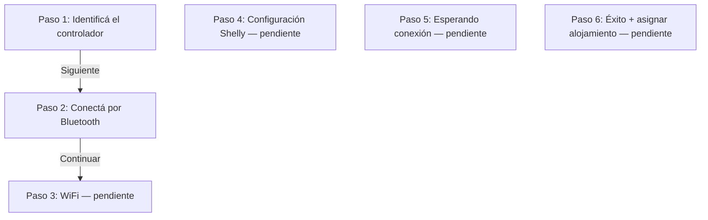

# Habitergy Link — Contexto para Agentes de IA

Este archivo provee contexto esencial para cualquier agente de IA (LLM) que deba crear o modificar la app Android **Habitergy Link** (adopción de controladores Shelly).

## 1. Resumen

| Aspecto | Detalle |
|---------|---------|
| **App** | Habitergy Link |
| **Package** | `com.habitergy.link` |
| **Carpeta** | `apps/link-android/` |
| **Propósito** | Wizard nativo de adopción de controladores **Shelly 1PM Gen3/Gen4** (BLE, WiFi, provisioning) |
| **Stack** | Kotlin + Jetpack Compose + Material 3 |
| **Build** | Gradle ( **no** forma parte de pnpm/Turbo del monorepo ) |
| **Versión actual** | `0.1.10` — paso **1 real** (lookup API + checksum), paso **2 placeholder** BLE |
| **Play Store (planeado)** | Habitergy Link |

Link reemplaza el wizard web de adopción en Android: acceso nativo a BLE, WiFi y provisioning sin limitaciones de Web Bluetooth ni mixed content.

## 2. Relación con el resto de la plataforma

```
┌─────────────────┐     deep link (futuro)     ┌─────────────────┐
│  Manager PWA    │ ─────────────────────────► │  Habitergy Link │
│  (panel partner)│ ◄───────────────────────── │  (Android nativo)│
└────────┬────────┘     vuelve con éxito      └────────┬────────┘
         │                                              │
         └──────────────────┬───────────────────────────┘
                            │ HTTP / JWT
                       ┌────▼────┐
                       │ apps/api│
                       └────┬────┘
                            │ MQTT
                       ┌────▼────┐
                       │  Shelly │
                       └─────────┘
```

- **Manager** (`apps/manager`): panel diario (alojamientos, consumo, finanzas). En Android, el CTA «Adoptar controlador» debería abrir Link (App Link), no el wizard PWA.
- **API** (`apps/api`): auth JWT, lookup de device por código, registro de adopción (endpoints de adopción **aún por implementar** en backend).
- **Base de datos** (`packages/database`): tabla fría `devices` con `device_code`, `mac_address`, `model`, `status`.
- **Flujo web legacy:** `docs/flows/adopcion-controladores.md` describe el wizard de 6 pasos en Manager PWA. **Link redefine los pasos** (ver §6); usar ese doc como referencia de producto, no como mapa 1:1 de pantallas.

## 3. Diseño UI/UX — LEER SIEMPRE ANTES DE TOCAR LA UI

> La fuente de verdad del diseño es **`docs/Guia_M3_expressive_Habitergy.md`**. Link debe verse como extensión del Manager, no como otra marca.

Reglas clave:

- **Jetpack Compose + Material 3** con tokens Habitergy en `ui/theme/`.
- **Tokens compartidos (JSON):** `packages/design-tokens/habitergy-m3.json` — colores, tipografía, espaciado. Al cambiar la paleta, actualizar JSON + `ui/theme/Color.kt` (o generar desde JSON en el futuro).
- **Color primario único:** verde `#2F6B43`. No hardcodear otros hex en pantallas; usar `HabitergyColors` o `MaterialTheme.colorScheme`.
- **Tipografía:** Roboto / SansSerif con escalas definidas en `ui/theme/Typography.kt` (34/700 títulos, 16/500 botones, etc.).
- **Mobile first**, grilla 8dp: márgenes laterales 24dp, footer inferior 32dp, contenido max ~448dp (como Manager).
- **Textos de UI en español (es-AR).**

### Componentes reutilizables (preferir antes de crear nuevos)

| Componente | Archivo | Uso |
|------------|---------|-----|
| `AdoptionScreenScaffold` | `ui/components/AdoptionScaffold.kt` | Shell del wizard: gradiente, header pasos, footer |
| `AdoptionStepHeader` | idem | «PASO X DE 6» + barras de progreso |
| `ScreenTitle` | idem | Título + subtítulo centrados |
| `HabitergyPrimaryButton` | `ui/components/HabitergyButtons.kt` | CTA pill verde con flecha |
| `HabitergySecondaryButton` | idem | Outlined pill |
| `ShellyDeviceCard` | `ui/components/ShellyDeviceCard.kt` | Tarjeta seleccionable en listado BLE |
| `ControllerFoundBanner` | idem | Banner éxito «Controlador encontrado» |

## 4. Cómo ejecutar

Link **no** se ejecuta con `pnpm`. Usar Android Studio o Gradle:

```bash
cd apps/link-android
./gradlew :app:assembleDebug
./gradlew :app:installDebug   # emulador o dispositivo conectado
```

**Requisitos:** JDK 17, Android SDK 35, Android Studio Ladybug+ recomendado.

1. Android Studio → **Open** → `apps/link-android/`
2. Gradle Sync (genera `gradle/wrapper/gradle-wrapper.jar` si falta)
3. AVD Pixel 6, API 34+
4. Run ▶

Ver también `apps/link-android/README.md`.

## 5. Estructura del código

```
apps/link-android/
├── build.gradle.kts              # Plugins Android/Kotlin/Compose/Serialization
├── settings.gradle.kts
├── version.properties            # versionName + versionCode (fuente de verdad)
├── scripts/release.sh            # Bump, tag y push a GitHub
├── gradle.properties
└── app/
    ├── build.gradle.kts          # applicationId, minSdk 26, Ktor + serialization deps
    └── src/main/
        ├── AndroidManifest.xml   # Permisos BLE, location, camera, INTERNET
        ├── res/xml/network_security_config.xml  # HTTPS only (sin cleartext)
        ├── java/com/habitergy/link/
        │   ├── MainActivity.kt           # Entry: HabitergyTheme + AdoptionFlow
        │   ├── domain/
        │   │   ├── DeviceCode.kt         # Sufijo nanoId + prefijo SH- (réplica de nanoId.ts)
        │   │   └── model/
        │   │       └── AdoptionModels.kt # UiState, enums, data classes, DeviceLookupState
        │   ├── data/
        │   │   ├── api/                  # Ktor: ApiConfig, AdoptionApi, AdoptionDeviceDto
        │   │   └── AdoptionRepository.kt # Lookup device_code → AdoptionLookupResult
        │   └── ui/
        │       ├── adoption/
        │       │   ├── AdoptionFlow.kt       # Switch paso 1 / 2
        │       │   ├── AdoptionViewModel.kt  # Lógica del wizard (lookup real)
        │       │   ├── Step1IdentifyScreen.kt
        │       │   └── Step2BleScanScreen.kt  # Placeholder BLE
        │       ├── components/             # Scaffold, botones, tarjetas, DeviceCodeInput
        │       └── theme/                  # HabitergyColors, Theme, Typography, Shape
        └── res/                            # strings, colors, launcher, themes
```

### Capas (convención para crecer)

| Capa | Paquete | Responsabilidad |
|------|---------|-----------------|
| UI | `ui/` | Composables, ViewModels |
| Dominio | `domain/` | `DeviceCode` (sufijo nanoId), modelos puros sin Android |
| Datos | `data/api/` | Ktor → `apps/api` (lookup adopción) |
| Datos | `data/` | `AdoptionRepository` (abstracción sobre la API) |
| (futuro) | `data/ble/` | `BluetoothLeScanner`, GATT Shelly (paso 2 real) |

## 6. Flujo de adopción (Link) — estado actual

Wizard planificado de **6 pasos** (`AdoptionUiState.totalSteps = 6`). Solo **1 y 2** implementados.



### Paso 1 — Identificá el controlador (`Step1IdentifyScreen`)

Dos modos (`IdentificationMode`):

| Modo | Cómo se activa | Comportamiento |
|------|----------------|----------------|
| **WithCode** | Default; usuario escribe los 5 caracteres del sufijo o escanea QR | Validación local de checksum → lookup API → estado de UI |
| **NoCode** | Botón «¿No tenés el código?» | Sin MAC; avanza directo al paso 2 (placeholder) |

Formato del `device_code`: `SH-XXXXC` — prefijo `SH-` fijo + sufijo **nanoId** de 5 chars (mismo algoritmo que `siteCode`). Ej.: site `KX67W` ↔ device `SH-KX67W`. La UI muestra `SH-` fijo y 5 cajas para el sufijo.

Acciones:

- **Campo código:** el usuario tipea el sufijo de 5 chars (cuerpo + checksum). Al cambiar, se resetea el estado de lookup.
- **Al completar el 5º carácter** (`onDeviceCodeChange` → `resolveDeviceCode`):
  1. **Checksum local** (`DeviceCode.isValidSuffix` = nanoId): si falla → `DeviceLookupState.Invalid` → aviso rojo «Código inválido» (sin llamar a la API).
  2. Si pasa → `AdoptionRepository.lookup("SH-XXXXC")` → `GET /api/adoption/devices/:deviceCode`:
     - `200 status=available` → `Available` (verde «Controlador encontrado: <modelo>») + `ResolvedDevice` con MAC.
     - `200 status=assigned` → `Assigned` (rojo «Este controlador ya está asignado»).
     - `200 status=otro` (rma/lost/damaged) → `Unavailable` (rojo «no disponible para adoptar»).
     - `404` → `NotFound` (rojo «No encontramos un controlador con ese código»).
     - error de red / otro → `NetworkError` (rojo «No pudimos verificar el código…»).
- **Escanear QR:** botón visible, snackbar «Coming soon» (sin CameraX aún).
- **Siguiente:** habilitado solo si `lookupState == Available`; avanza al paso 2. Si `NoCode`, avanza directo.

Colores: verde `HabitergyColors.Primary` (Available), rojo `HabitergyColors.Error` (resto). Border de las cajas y mensaje reflejan `lookupState`.

### Paso 2 — Conectá por Bluetooth (`Step2BleScanScreen`)

**Placeholder.** El escaneo BLE real (`BluetoothLeScanner` + filtro Allterco) no está implementado. La pantalla muestra un aviso «próximamente» + botón Volver. No usa datos mock. La máquina de estados `BleScanPhase` (Matched/SelectDevice/Empty/Error) se conserva en `AdoptionModels` para cuando se implemente BLE real contra un repositorio BLE.

Navegación: `AdoptionFlow` hace `when (state.currentStep)`; back en paso 2 → `goBackToStep1()`.

## 7. Estado y lógica (`AdoptionViewModel`)

Fuente única de verdad: `StateFlow<AdoptionUiState>`. Depende de `AdoptionRepository` (inyectable, default `AdoptionRepository()`).

Campos principales:

```kotlin
// Paso 1
deviceCodeInput, identificationMode, resolvedDevice, lookupState

// Paso 2
bleScanPhase, scannedDevices, matchedDevice, selectedDeviceId, bleErrorMessage

// Navegación
currentStep, totalSteps (= 6)
```

Propiedades derivadas en `AdoptionUiState`:

- `isLookingUp` — `lookupState == Looking`
- `canProceedFromStep1` — `lookupState == Available`
- `targetMacAddress` — MAC del `resolvedDevice` (null si NoCode)
- `selectedDevice` — `matchedDevice` o el elegido en lista

**Al implementar BLE real:** restaurar `startBleScan()` en `AdoptionViewModel` llamando un repositorio BLE; reutilizar la máquina de estados `BleScanPhase`.

## 8. Datos mock

**Eliminados.** `MockAdoptionData.kt` y todos los datos de prueba (CX123/AB123/T3ST1, lista BLE fija, `MOCK_QR_DEVICE_CODE`, helper `macsMatch`) fueron retirados. El paso 1 usa lookup real contra la API; el paso 2 es un placeholder sin datos mock.

## 9. Qué es real vs mock

| Funcionalidad | Estado |
|---------------|--------|
| UI pasos 1–2 | **Real** (Compose) |
| Tema M3 Habitergy | **Real** |
| Validación checksum device_code | **Real** (`domain/DeviceCode.kt`, réplica de `nanoId.ts`) |
| Lookup deviceCode → MAC/model/status | **Real** (`AdoptionRepository` → `GET /api/adoption/devices/:deviceCode`) |
| Cliente HTTP (Ktor) | **Real** |
| Escaneo QR | **Placeholder** (botón + snackbar «Coming soon») |
| Escaneo BLE | **Placeholder** (pantalla «próximamente») |
| Auth JWT / login | **No implementado** |
| GATT / RPC-over-BLE Shelly | **No implementado** |
| WiFi provisioning (paso 3+) | **No implementado** |
| Deep link desde Manager | **No implementado** |

## 10. Permisos (`AndroidManifest.xml`)

- `BLUETOOTH`, `BLUETOOTH_ADMIN` (maxSdk 30) — BLE real (futuro)
- `BLUETOOTH_SCAN`, `BLUETOOTH_CONNECT` — BLE real (futuro)
- `ACCESS_FINE_LOCATION` (requerido para BLE scan en Android)
- `CAMERA` (QR, futuro)
- `INTERNET` — lookup HTTP contra `apps/api` (**en uso**)

`uses-feature`: `bluetooth_le` required; `camera` optional.
`networkSecurityConfig`: solo HTTPS (sin cleartext).

## 11. Protocolo Shelly (referencia para BLE real)

Al implementar escaneo/conexión real, reutilizar la lógica documentada en Manager:

| Concepto | Valor / ubicación |
|----------|-------------------|
| Manufacturer ID Allterco | `0x0BA9` — `apps/manager/src/lib/bluetooth/shellyManufacturerData.ts` |
| Modelos soportados | Gen3 `0x1019`, Gen4 `0x1029` — `shellyModels.ts` |
| RPC-over-BLE flag | bit 2 en manufacturer data |
| Formato device_code en BD | `SH-XXXXC` (prefijo `SH-` + sufijo nanoId) — `packages/utils/src/shortCode.ts` delega en `nanoId.ts` |
| Tabla devices | `mac_address`, `device_code`, `model`, `status` — `packages/database/schema.prisma` |

Manager también tiene parsing de anuncios en `shellyAdvertisement.ts` — portar a Kotlin en `data/ble/` cuando corresponda.

## 12. API backend (integración)

Endpoints relevantes:

- `GET /api/adoption/devices/:deviceCode` — **lookup de adopción** (público). Devuelve `{ deviceCode, model, macAddress, status }`. Usado por el paso 1. Ver `apps/api/src/controllers/adoptionController.ts`.
- `GET /api/devices/code/:deviceCode` — consulta pública por código (estado/telemetría, usado por Habitergy GO). Ver `apps/api/src/controllers/deviceController.ts`.
- `GET /api/devices` — lista del partner autenticado.

**Pendiente para adopción completa:** endpoint de registro/provisionamiento del dispositivo adoptado y vinculación a `site_id` (pasos 4–6).

Cliente HTTP: **Ktor Client** en `data/api/` (`AdoptionApi`), base URL en `ApiConfig` → `https://api.habitergy.com`. Auth: JWT igual que Manager (`Authorization: Bearer`) cuando se implemente login.

## 13. Convenciones para agentes

1. **No mezclar con pnpm:** no agregar Link a `pnpm-workspace.yaml` ni `turbo.json` salvo tarea documental explícita.
2. **Mantener continuidad visual con Manager:** cambios de tokens → actualizar `packages/design-tokens/habitergy-m3.json` + `ui/theme/`.
3. **ViewModel + StateFlow:** nueva lógica de wizard en `AdoptionViewModel`; Composables solo renderizan estado.
4. **Checksum unificado (nanoId):** `domain/DeviceCode.kt` replica `packages/utils/src/nanoId.ts` (mismo algoritmo que `siteCode`). `shortCode.ts` solo agrega el prefijo `SH-`. Cualquier cambio en nanoId debe replicarse en Kotlin. Para I/O nueva, crear un repositorio en `data/` e inyectarlo en el ViewModel.
5. **Textos en español (es-AR).**
6. **minSdk 26** — no bajar sin justificación (BLE moderno).
7. Al agregar paso 3+: incrementar navegación en `AdoptionFlow.kt`, reutilizar `AdoptionScreenScaffold`, mantener `totalSteps = 6` alineado al producto.
8. **Releases:** si el usuario pide subir/publicar una nueva versión, seguir **§16** y ejecutar `./scripts/release.sh` (patch por defecto; minor solo si lo pide explícitamente). No editar versiones a mano salvo que el usuario lo indique.

## 14. Roadmap técnico (prioridad sugerida)

- [ ] BLE real: `BluetoothLeScanner` + filtro Allterco + parseo manufacturer data
- [ ] QR real: CameraX + ML Kit / ZXing
- [x] API lookup: `GET /api/adoption/devices/:deviceCode` (paso 1)
- [x] Validación checksum unificada nanoId (`siteCode` + `deviceCode` SH-XXXXC)
- [ ] Login partner (JWT) al abrir Link o vía token en deep link
- [ ] Paso 3: WiFi SSID + contraseña → RPC-over-BLE al Shelly
- [ ] Pasos 4–6: MQTT config, espera online, asignar alojamiento
- [ ] App Link: `https://app.habitergy.com/adoptar-controlador` → abre Link
- [ ] Manager Android: botón «Adoptar» abre Link en lugar del wizard web

## 15. Guía rápida: agregar una pantalla al wizard

1. Leer `docs/Guia_M3_expressive_Habitergy.md`.
2. Crear `StepN…Screen.kt` en `ui/adoption/` usando `AdoptionScreenScaffold`.
3. Extender `AdoptionUiState` y `AdoptionViewModel` con el estado del paso.
4. Registrar en `AdoptionFlow.kt` (`when (state.currentStep)`).
5. Si hay I/O: crear un repositorio en `data/` (y API en `data/api/`) e inyectarlo en el ViewModel.
6. Probar en emulador Android Studio.
7. Actualizar este `AGENTS.md` y `README.md` si cambia el flujo o el estado real/mock.

## 16. Releases y versionado

Repositorio público standalone: **`Maurix09/habitergy-link-android`** (https://github.com/Maurix09/habitergy-link-android).

### Fuente de verdad

| Archivo | Contenido |
|---------|-----------|
| `version.properties` | `versionName` (semver) y `versionCode` (entero Android) |
| `app/build.gradle.kts` | Lee `version.properties` automáticamente |
| Tag Git `vX.Y.Z` | Referencia de la última versión publicada en GitHub |

### Cuándo ejecutar un release

Si el usuario dice cosas como:

- «Subí la nueva versión»
- «Publicá link-android en GitHub»
- «Hacé release de Link»

→ Ejecutar **patch** (incremento `0.1.x`):

```bash
cd apps/link-android
./scripts/release.sh patch
```

Si pide explícitamente pasar a `0.2.x` o «versión minor»:

```bash
./scripts/release.sh minor
```

Si pide una versión exacta (ej. `0.2.0`):

```bash
./scripts/release.sh 0.2.0
```

### Reglas de bump

| Comando | Ejemplo | Cuándo usar |
|---------|---------|-------------|
| `patch` (default) | `0.1.3` → `0.1.4` | Cada release habitual |
| `minor` | `0.1.12` → `0.2.0` | Solo si el usuario lo pide |
| `X.Y.Z` | fija `0.3.0` | Versión explícita del usuario |

Prioridad para calcular la base: **último tag `v*` en GitHub** → si no hay tags, `version.properties`.

`versionCode` siempre incrementa +1 (requerido por Play Store).

### Qué hace `scripts/release.sh`

1. Clona/actualiza el repo standalone en `/tmp/habitergy-link-android` (o `LINK_ANDROID_STANDALONE_DIR`)
2. Calcula la nueva versión
3. Actualiza `version.properties` y la fila **Versión actual** de este `AGENTS.md`
4. Sincroniza todo el proyecto al repo standalone
5. Commit `release: vX.Y.Z`, tag `vX.Y.Z`, push a `main`
6. Crea GitHub Release (si `gh` está autenticado)

### Desarrollo en monorepo vs standalone

- **Desarrollo:** normalmente en `apps/link-android/` dentro de `habitergy-platform`
- **Publicación:** siempre vía `./scripts/release.sh` → repo standalone en GitHub
- El usuario en Windows clona `habitergy-link-android` y hace `git pull` para obtener la última versión

### No hacer en releases

- No subir versión en cada commit de desarrollo
- No editar `versionName`/`versionCode` a mano si el usuario pidió un release (usar el script)
- No usar `minor` salvo pedido explícito del usuario
